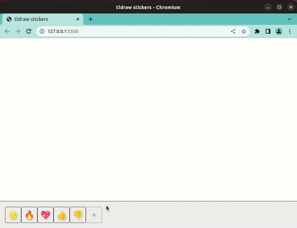

# tldraw take-home

In this challenge, we were assigned the ticket to create the basic functionality of stickers in a whiteboarding app.

The following features have been implemented as per the ticket (see below):

- [x] 1. Implement the basics of the feature
- [x] 2. Create issues with user stories for further feature development (see )
- [x] 3. STRETCH GOAL: Pick a user story from (2) and implement it

I decided to implement the user story:
* As a user, I want to be able to add button(s) to the toolbar, each for a custom emoji that I can choose.

Here is a quick summary of the app in action:

---

TICKET:

> Stickers are little shapes that you can stamp down on a drawing to give a quick thumbs up, share some love, vote on a topic, or bring some attention to part of the page. After choosing a sticker, a user can place a sticker by clicking anywhere on the page.

---

1. In this repository, implement the basics of the feature as shown and described above. Use **regular HTML and CSS**. Do not use HTML canvas (ie the `<canvas>` element) and do not use any third party libraries. Feel free to use emojis for the stickers (🌟, 🔥, 💖, 👍, 👎).
2. Next, think beyond the basic specification written in the ticket. What else does the demo show? What else might this stickers feature need before it was ready for people to use? Come up with a few ideas. Create issues in your from these issues in the form of user stories.
3. As a **stretch goal**, pick one of the stories you created in step two and implement it in your app.

